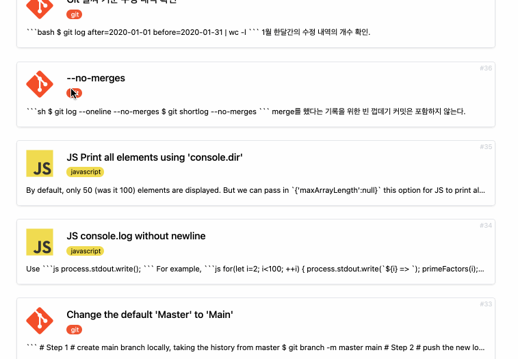

# TIL Logger

따로 정리해서 블로그에 올릴 정도는 아닌, 짧은 정보들을 이슈로 저장합니다.

 

# Demo 

# Todo
- [x] Create an issue 
- [x] Archive an issue
- [x] Unarchive an issue
  - [x] Delete an issue (possible only after archived)
- [x] Tagging (labeling) feature
  + [x] filter by tag
- [x] Search by title (utilized AJAX and partial rendering)
- [x] SNS link (github and twitter) 
- [ ] ~~Mobile UI~~ postponed.
- [x] Dark mode

# Progress 
- **Completed**
- 2022-01-01 -- [tweet](https://twitter.com/euisblue/status/1477240640845279235?s=20) 
  + Dark mode added 
  + used localStorage to cache the state of 'darkmode'
- 2021-12-31 JST [tweet](https://twitter.com/euisblue/status/1476920357202194433?s=20)
  + Re-designed the whole UI - changed to a card-deck style from a simple list 
- 2021-12-30 JST [tweet](https://twitter.com/euisblue/status/1476567344864727042?s=20)
  + implemented tag filtering 
  + implemented searching (used AJAX to update the section) 
- 2021-12-29 [tweet](https://twitter.com/euisblue/status/1475829424381919239?s=20) 
  + tagging feature added
- 2021-12-28 [tweet](https://twitter.com/euisblue/status/1475631622430937090?s=20)
  + organized the overall UI 
  + tagging logic added but not tested yet 
- 2021-12-27 [tweet](https://twitter.com/euisblue/status/1475471820002578435?s=20)
  + mostly UI - worked on page navigation
- 2021-12-26 [tweet](https://twitter.com/euisblue/status/1475116117240987648?s=20)
  + CRUD added - 'archiving' instead of a deleting
- **Begin**
